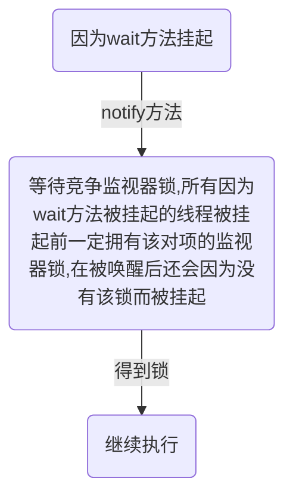

# 第1章 并发编程线程基础

------

[TOC]

------

## 1. 什么是线程

​		进程是代码在数据集合上的依次运行活动,是系统进行资源分配和调度的基本单位.线程则是进程的一个执行路径,一个进程中至少一个线程.进程中的多个线程共享进程的资源.

​		操作系统在分配资源时是把资源分配给进程的,但是CPU资源是被分配给线程的.

​		一个进程中有多个线程,多个线程共享进程的**<u>堆</u>**(存放对象实例)和**<u>方法区</u>**(类,常量和静态变量),每个线程有自己的**<u>程序计数器</u>**(记录下一步要执行的指令地址,用于记录当前线程执行的位置)和**<u>栈</u>**区域(储存该项成的局部变量,和方法调用帧栈).

## 2. 线程创建与运行

​		Java有三种创建线程的方式,分别为**<u>实现Runnable接口的Run方法</u>**(将接口对象传入Thread对象,运行Thread对象的start()方法),**<u>继承Thread类</u>**(执行start()方法)和**<u>FutureTask方式</u>**(实现Callable<E>接口,泛型E为线程返回值的类型,将接口实例对象传入FutrueTask对象,再将FutrueTask对象传入Thread对象,执行start方法).

FutureTask方式:

```Java
public class CallerTask implements Callable<String>{

        @Override
        public String call() throws Exception {
            System.out.println("child thread");
            return "hello";
        }

        public static void main(String[] args) {
            FutureTask<String> futureTask = new FutureTask<<u>wait()方法在挂起该线程的同时释放该线程的监视器锁>(new CallerTask());
            new Thread(futureTask).start();
            try{
                String result = futureTask.get();
                System.out.println(result);
            } catch (ExecutionException | InterruptedException e) {
                e.printStackTrace();
            }
        }
    }
```

​		其中实现Runnable接口的方法可以实现方法重用(接口中的方法不占多分空间,而多个Thread子类对象的每一个Run()方法都需要占用堆内存).

<u>**优缺点:**</u>

-   <u>**继承Thread类:方便传参(成员变量,get(),set()方法)**</u>
-   <u>**实现Runnable接口:没有单继承的限制**</u>
-   <u>**FutureTask方法:线程的运行可以有返回值.**</u>

## 3. 线程通知与等待

### (1). wait()函数

​		当一个线程调用了某个对象的wait()方法后,这个线程会被阻塞挂起.

1.  只有当其他线程调用了**<u>此对象</u>**的notify()或notifyAll()方法,该线程才能被返回
1.  当其他线程调用了**<u>该线程</u>**的interrupt()方法,该线程抛出异常返回

​		<u>**要使用某对象wait()函数,就必须实现得到了该对象的监视器锁**</u>(也就是之前的线程锁),有两种途径:1.当前在该对象的**<u>同步方法</u>**(成员方法)中. 2.在该对象的**<u>同步代码块</u>**中.那就意味这,在调用wait()方法时,当前线程一定是被这个对象的监视器锁锁住的,那么**<u>wait()方法在挂起该线程的同时释放该线程的监视器锁</u>**.

​		注意:如果一个线程同时拥有A,B两个对象的监视器锁,调用了对象A的wait()方法后并不会释放B对象的监视器锁.

​		线程被挂起后是有可能无缘无故被唤醒的,这叫做虚假唤醒,通常在唤醒的条件上加while循环(取非)以避免这种情况.

### (2). wait(long timeout)函数

​		多了一个参数,这是一个毫秒(千分之一秒)数,当过了这个时间并且还没有被notify或者notifyAll()方法唤醒,那么该函数还是会因为超时而返回.

### (3). notify()函数

​		随机唤醒一个在该变量的wait()方法上挂起的线程(该对象可能挂了多个线程).和wait()方法一样,都需要会的该对象的监视器锁才能调用.



### (4). notifyAll方法

​		会唤醒所有因为该共享变量的wait()方法而被挂起的线程.

## 4. 等待线程执行终止的join方法

​		在主线程中使用,该方法会挂起主线程,当子线程执行完之后返回该方法.

## 5. 让线程睡眠的sleep方法

​		Thread类中有一个静态的Sleep方法,当一个执行中的线程调用了Thread的sleep方法,调用线程会暂停让出CPU的执行权,但**<u>并不让出所拥有的监视器资源</u>**.知道达到指定的睡眠时间后该函数返回,线程处于就绪状态.	

## 6. 让出CPU执行权的yield方法

​		Thread类中有一个静态的yield方法,当一个线程运行这个方法时,实际上就是按时线程调度器让出当前自己的CPU使用权,然后立即处于就绪状态,参与线程轮换.

​		与sleep的不同在于yield方法不会挂起当前线程.

## 7. 线程中断

​		<u>**Java中的线程中断是一种线程间的协作模式,通过修改线程对象中的一个标识(中断标识),在线程运行代码中检测该标识的值,并作出一些动作响应中断.**</u>可以是退出线程也可以是yield,取决于代码实现.

三个方法:

-   void interrupt()方法:中断该线程,将中断标记设置为true.
-   boolean isInterrupted()方法:检测该线程是否被中断
-   boolean interrupted()方法:静态方法,检测**<u>当前调用该方法的线程</u>**是否被中断,如果被中断,修改中断标记为false.

​		另一种用法:当出于一些原因需要立刻唤醒某个线程(因wait()或sleep()方法被挂起)时,可以调用这个线程的interrupt()方法,强制抛出InterruptedException异常,并且返回,线程恢复到激活状态.

## 8. 理解线程上下文切换

​		CPU资源的分配采用时间片轮换的策略,也就是给每一个线程分配一个时间片,线程在时间片内占用CPU执行任务.当前线程使用完时间片后就会处于就绪状态,让出CPU供其他线程使用,这就是上下文切换.

​		上下文切换的时机:当前线程的CPU时间片使用完,处于就绪状态,当前线程被其他线程中断.

## 9. 线程死锁

### (1). 什么是线程死锁

​		死锁指两个或两个以上的线程在执行过程中,因争夺资源而造成的互相等待的现象.

死锁产生的条件:

-   **<u>互斥条件</u>**:线程对已经获取到的资源进行排他性使用,即该资源只能由一个线程占用.(监视器锁只能由一个线程获取)
-   **<u>请求并持有条件</u>**:一个线程至少持有一个资源,并要获取其他新的资源,但这个资源已经被其他资源占有.(持有资源,等待别人占有的资源)
-   **<u>不可剥夺条件</u>**:线程获取到的资源在自己使用完之前不能被其他线程抢占.(保持自己的锁)
-   **<u>环路等待条件</u>**:发生死锁时,必然存在线程-资源的唤醒等待链.(那么两个线程就是相互等待)

### (2). 如何避免线程死锁

​		只需要破坏四个条件之一即可,但是目前只有请求并持有和环路等待条件是可以被破坏的.

## 10. 守护线程与用户线程

​		Java中的线程分为两类,分为**<u>daemon线程</u>**(守护线程,例如GC线程)和**<u>user线程</u>**(用户线程,例如main函数所在的主线程).

​		<u>**区分是当最后一个用户线程结束时,JVM会正常退出,不会考虑守护线程的运行.**</u>言外之意,只要还存在一个用户线程,JVM就不会退出.(实质是:当main线程运行结束后,JVM会自启动一个叫DestroyJavaVM的线程,这个线程会等待所有用户线程结束,然后结束JVM进程)

​		要创建守护线程只需要**<u>设置线程的daemon参数为true</u>**即可.

```Java
public static void main(String[] args){
	Thread deamonThread = new Thread(new Runnable(){
		public void run(){
			//do something
		}
	});
	
	//设置为守护线程
	deamonThread.setDeamon(true);
	deamonThread.start();
}
```

​		如果希望在主线程结束后,JVM马上结束,可以将创建的线程设置为守护线程.

## 11. ThreadLocal

​		**<u>ThreadLocal意为线程本地变量</u>**，是解决多线程安全问题的另一种途径。使用线程锁是用时间换取空间，而ThreadLocal则是使用空间换取时间效率。

​		**<u>ThreadLocal类可以在每一个线程中创建一个同名的变量，但是会在每一个线程中存储一个副本，在使用该变量时，会拿出副本进行使用。也就是说，相当于在每一个线程中都存储了属于线程自己的变量。访问该变量时不受其他线程的影响，该变量时该线程独有的。</u>**

### (1). ThreadLocal实现原理

​		**<u>ThreadLocal类中有一个成员变量ThreadLocals(类型为ThreadLocalMap,实际存放在Thread线程对象中,是ThreadLocal对象的成员变量)</u>**,这个变量本来为null,使用时才会初始化.

​		**<u>每次使用ThreadLocal对象时,会先从当前线程的线程对象中取出ThreadLocalMap对象,这是一个map,然后以这个ThreadLocal对象为key,去存储value或者获取value.</u>**

​		对于不同的线程中,由于取得的是不同的ThreadLocalMap对象,所以取值互不干扰.对于一个线程内的不同ThreadLacal对象,由于访问map时的key不同,所以访问的值也不同

#### 1). ThreadLocalMap getMap(Thread t)

​		根据传入的线程对象获取线程中的ThreadLocalMap对象

#### 2). T get()

​		先获取当前线程,然后获取线程中的ThreadLocalMap对象,以this对象(ThreadLocal对象)为key,取出ThreadLocalMap中的value.

#### 3). void set(T value)

​		先获取当前线程,然后获取ThreadLocalMap对象,然后以当前的ThreadLocal对象为key,设置value.

### (2). ThreadLocalMap类

​		这是一个Map,但是与HashMap不同的是,ThreadLocalMap使用的是开放探测法(HashMap链地址法).就意味着大龄的变量存储在ThreadLocalMap对象中会使查询效率急剧下降.

### (3). ThreadLocal内存泄漏问题

​		ThreadLocalMap的key使用了弱引用，**<u>当key不被引用时，系统回收内存会自动清理key的内存(清理ThreadLocal对象)</u>**。导致map中的value无法被访问，但问题在于map中的entry以属性的方式包含了object value。这样一来导致没有key可以访问这个value，但是**<u>存在一条强引用链：CurrentThread->ThreadLocalMap->Entry->Value</u>**。这条链是不能被GC（垃圾回收）自动回收的。这样就导致这些value数据既不能被访问而手动清理，也不会被被自动清理,就形成了内存泄露.

​		ThreadLocalMap内部Entry中key使用的是对ThreadLocal对象的弱引用，这为避免内存泄露是一个进步，因为如果是强引用，那么即使其他地方没有对ThreadLocal对象的引用，ThreadLocalMap中的ThreadLocal对象还是不会被回收，而如果是弱引用则这时候ThreadLocal引用是会被回收掉的，虽然对于的value还是不能被回收，这时候ThreadLocalMap里面就会存在key为null但是value不为null的entry项，虽然ThreadLocalMap提供了set,get,remove方法在一些时机下会对这些Entry项进行清理，但是这是不及时的，也不是每次都会执行的，所以一些情况下还是会发生内存泄露，所以在使用完毕后即使调用remove方法才是解决内存泄露的王道。

### (4). ThreadLocal不支持继承性

​		父线程的ThreadLocal对象在子线程中是获取不到的,因为这是两个Thread对象.

### (5). InheritableThreadLocal类

​		这个类是为了解决ThreadLocal类不支持继承而创造的,它继承自ThreadLocal类.提供了一个特性,可以让子线程访问父线程中设置的本地变量.

ThreadLocalMap源码:

```java
/**
 * Construct a new map including all Inheritable ThreadLocals
 * from given parent map. Called only by createInheritedMap.
 *
 * @param parentMap the map associated with parent thread.
 */
private ThreadLocalMap(ThreadLocalMap parentMap) {
    Entry[] parentTable = parentMap.table;
    deint len = parentTable.length;
    setThreshold(len);
    table = new Entry[len];

    for (int j = 0; j < len; j++) {
        Entry e = parentTable[j];
        if (e != null) {
            @SuppressWarnings("unchecked")
            ThreadLocal<Object> key = (ThreadLocal<Object>) e.get();
            if (key != null) {
                Object value = key.childValue(e.value);
                Entry c = new Entry(key, value);
                int h = key.threadLocalHashCode & (len - 1);
                while (table[h] != null)
                    h = nextIndex(h, len);
                table[h] = c;
                size++;
            }
        }
    }
}
```

​		从上面的构造可以看出,这种构造方式可以将父线程的ThreadLocalMap复制给子线程.达到共用的目的.

​		经测试,但一旦建立子线程,更改父线程中的InheritableThreadLocal对象后,子线程并不能察觉.

```java
public class Demo {
    public static void main(String[] args) throws InterruptedException {
        InheritableThreadLocal<Integer> inheritableThreadLocal = new InheritableThreadLocal<>();
        inheritableThreadLocal.set(1);
        Thread thread = new Thread(new Runnable() {
            @Override
            public void run() {
                System.out.println("chile thread " + inheritableThreadLocal.get());
                try {
                    Thread.sleep(1000);
                } catch (InterruptedException e) {
                    e.printStackTrace();
                }
                System.out.println("chile thread " + inheritableThreadLocal.get());
            }
        });

        thread.start();
        Thread.sleep(500);
        System.out.println("parents thread " + inheritableThreadLocal.get());
        inheritableThreadLocal.set(2);
        System.out.println("set 2");
        System.out.println("parents thread " + inheritableThreadLocal.get());
        thread.join();
    }
}

// chile thread 1
// parents thread 1
// set 2
// parents thread 2
// chile thread 1
```

