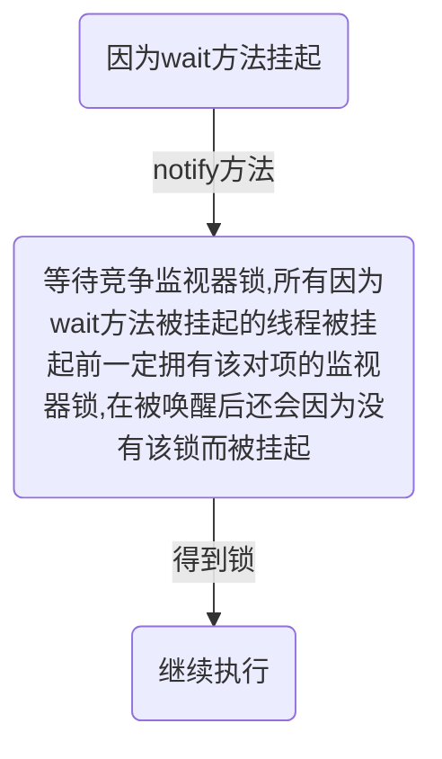

------

[TOC]

------

# 1. 什么是线程

​		**线程是CPU调度的单位，进程是资源分配的单位**.

​		一个进程中有多个线程,多个线程共享进程的**堆**(存放对象实例)和**方法区**(类,常量和静态变量),每个线程有自己的**程序计数器**(记录下一步要执行的指令地址,用于记录当前线程执行的位置)和**栈**区域(储存该项成的局部变量,和方法调用帧栈).

# 2. 线程创建与运行

​	线程的三种创建方式

1. **继承Thread类并重写run方法**(执行start()方法)

2. **实现Runnable接口的Run方法**(将接口对象传入Thread对象,运行Thread对象的start()方法)

3. **FutureTask方式**(实现Callable<E>接口,泛型E为线程返回值的类型,将接口实例对象传入FutrueTask对象,再将FutrueTask对象传入Thread对象,执行start方法).

1.继承Thread类并重写run方法

```java
public class Test{
	
    //继承Thread类并重写run方法
    public static class MyThread extends Thread{
    	@Override
    	public void run(){
 			System.out.println("This is a child thread");
    	}
    }

    public static void main(String[] args){
        //创建线程
        MyThread thread = new MyThread();
        //启动线程
        thread.start();
    }
}
```

2.实现Runnable接口的Run方法

```java
public static class RunableTask implements Runnable{
    @Override
    public void run(){
 			System.out.println("This is a child thread");
    }
}

public static void main(String[] args) throws InterruptedException{
    RunableTask task = new RunableTask();
    new Thread(task).start();
}
```

3.FutureTask方式:

```java
public class CallerTask implements Callable<String>{

        @Override
        public String call() throws Exception {
            return "hello";
        }

        public static void main(String[] args) {
            //创建异步任务，wait()方法在挂起该线程的同时释放该线程的监视器锁
            FutureTask<String> futureTask = new FutureTask<>(new CallerTask());
            //启动线程
            new Thread(futureTask).start();
            try{
                String result = futureTask.get();
                System.out.println(result);
            } catch (ExecutionException | InterruptedException e) {
                e.printStackTrace();
            }
        }
    }
```

​		其中实现Runnable接口的方法可以实现方法重用(接口中的方法不占多分空间,而多个Thread子类对象的每一个Run()方法都需要占用堆内存).

**优缺点:**

-   **继承Thread类:方便传参(成员变量,get(),set()方法)**
-   **实现Runnable接口:没有单继承的限制**
-   **FutureTask方法:线程的运行可以有返回值.**

# 3. 线程通知与等待

### (1). wait()

​		当一个线程调用了某个对象的wait()方法后,这个线程会被阻塞挂起.

   	**使用某对象wait()的条件：得到了该对象的监视器锁(线程锁)**

1.  只有当其他线程调用了**此对象**的notify()或notifyAll()方法,该线程才能被返回
1.  当其他线程调用了**该线程**的interrupt()方法,该线程抛出异常返回

获得线程锁的两种途径:

1. 当前在该对象的**同步方法**(成员方法)中. 
2. 在该对象的**同步代码块**中

  在调用wait()方法时,当前线程一定是被这个对象的监视器锁锁住的,那么**wait()方法在挂起该线程的同时释放该线程的监视器锁**.

​		注意:线程被挂起后是有可能无缘无故被唤醒的,这叫做虚假唤醒,通常在唤醒的条件上加while循环(取非)以避免这种情况.

### (2). wait(long timeout)

​		timeout参数,单位毫秒,超出这个时间并且还没有被notify或者notifyAll方法唤醒,则该函数会因为超时而返回.

### (3). notify()

​		随机唤醒一个在该变量的wait()方法上挂起的线程(该对象可能挂了多个线程).和wait()方法一样,都需要获得该对象的监视器锁才能调用.



### (4). notifyAll()

​		会唤醒所有因为该共享变量的wait()方法而被挂起的线程.

# 4. join()方法

​	功能：等待线程执行终止		

​	在主线程中使用,该方法会挂起主线程,当子线程执行完之后返回该方法.

# 5. sleep()方法

​	功能：使线程睡眠

​	Thread类中有一个静态的Sleep方法,当一个执行中的线程调用了Thread的sleep方法,调用线程会暂停让出CPU的执行权,但**并不让出所拥有的监视器资源**.知道达到指定的睡眠时间后该函数返回,线程处于就绪状态.	

# 6. yield()方法

​	功能：让出CPU执行权	

​	Thread类中有一个静态的yield方法,当一个线程运行这个方法时,实际上就是按时线程调度器让出当前自己的CPU使用权,然后立即处于就绪状态,参与线程轮换.

​		sleep()方法与yield()方法的区别：sleep()方法使线程处于阻塞挂起态，yield()方法使线程处于就绪态

# 7. 线程中断

​		**Java中的线程中断是一种线程间的协作模式,通过修改线程对象中的一个标识(中断标识),在线程运行代码中检测该标识的值,并作出一些动作响应中断.**

三个方法:

-   void interrupt()方法:中断线程,将中断标记设置为true.
-   boolean isInterrupted()方法:检测该线程是否被中断
-   boolean interrupted()方法:静态方法,检测**当前调用该方法的线程**是否被中断,如果被中断,修改中断标记为false.

​		另一种用法:当出于一些原因需要立刻唤醒某个线程(因wait()或sleep()方法被挂起)时,可以调用这个线程的interrupt()方法,强制抛出InterruptedException异常,并且返回,线程恢复到激活状态.

# 8. 理解线程上下文切换

​		CPU资源的分配采用时间片轮换的策略,也就是给每一个线程分配一个时间片,线程在时间片内占用CPU执行任务.当前线程使用完时间片后就会处于就绪状态,让出CPU供其他线程使用,这就是上下文切换.

​		上下文切换的时机:当前线程的CPU时间片使用完,处于就绪状态,当前线程被其他线程中断.

# 9. 线程死锁

### (1). 什么是线程死锁

​		死锁指两个或两个以上的线程在执行过程中,因争夺资源而造成的互相等待的现象.

死锁产生的条件:

-   **互斥条件**:线程对已经获取到的资源进行排他性使用,即该资源只能由一个线程占用.(监视器锁只能由一个线程获取)
-   **请求并持有条件**:一个线程至少持有一个资源,并要获取其他新的资源,但这个资源已经被其他资源占有.(持有资源,等待别人占有的资源)
-   **不可剥夺条件**:线程获取到的资源在自己使用完之前不能被其他线程抢占.(保持自己的锁)
-   **环路等待条件**:发生死锁时,必然存在线程-资源的唤醒等待链.(那么两个线程就是相互等待)

### (2). 如何避免线程死锁

​		只需要破坏四个条件之一即可,但是目前只有请求并持有和环路等待条件是可以被破坏的.

# 10. 守护线程与用户线程

​		Java中的线程分为两类,分为**daemon线程**(守护线程,例如GC线程)和**user线程**(用户线程,例如main函数所在的主线程).

​		**区分是当最后一个用户线程结束时,JVM会正常退出,不会考虑守护线程的运行.**言外之意,只要还存在一个用户线程,JVM就不会退出.(实质是:当main线程运行结束后,JVM会自启动一个叫DestroyJavaVM的线程,这个线程会等待所有用户线程结束,然后结束JVM进程)

​		要创建守护线程只需要**设置线程的daemon参数为true**即可.

```Java
public static void main(String[] args){
	Thread deamonThread = new Thread(new Runnable(){
		public void run(){
			//do something
		}
	});
	
	//设置为守护线程
	deamonThread.setDeamon(true);
	deamonThread.start();
}
```

# 11. ThreadLocal

​		**ThreadLocal意为线程本地变量**，是解决多线程安全问题的另一种途径。使用线程锁是用时间换取空间，而ThreadLocal则是使用空间换取时间效率。

​		创建一个ThreadLocal变量后，那么访问这个变量的每个线程都会复制这个变量到本地内存。每个线程实际操作的使自己本地内存里的变量。

### (1). ThreadLocal实现原理

​		**ThreadLocal类中有一个成员变量ThreadLocals(类型为ThreadLocalMap,实际存放在Thread线程对象中,是ThreadLocal对象的成员变量)**,这个变量本来为null,使用时才会初始化.

​		**每次使用ThreadLocal对象时,会先从当前线程的线程对象中取出ThreadLocalMap对象,这是一个map,然后以这个ThreadLocal对象为key,去存储value或者获取value.**

​		对于不同的线程中,由于取得的是不同的ThreadLocalMap对象,所以取值互不干扰.对于一个线程内的不同ThreadLacal对象,由于访问map时的key不同,所以访问的值也不同

**1). ThreadLocalMap getMap(Thread t)**

​		根据传入的线程对象获取线程中的ThreadLocalMap对象

**2). T get()**

​		先获取当前线程,然后获取线程中的ThreadLocalMap对象,以this对象(ThreadLocal对象)为key,取出ThreadLocalMap中的value.

**3). void set(T value)**

​		先获取当前线程,然后获取ThreadLocalMap对象,然后以当前的ThreadLocal对象为key,设置value.

### (2). ThreadLocalMap类

​		这是一个Map,但是与HashMap不同的是,ThreadLocalMap使用的是开放探测法(HashMap链地址法).就意味着大量的变量存储在ThreadLocalMap对象中会使查询效率急剧下降.

### (3). ThreadLocal内存泄漏问题

​		ThreadLocalMap的key使用了弱引用，**当key不被引用时，系统回收内存会自动清理key的内存(清理ThreadLocal对象)**。导致map中的value无法被访问，但问题在于map中的entry以属性的方式包含了object value。这样一来导致没有key可以访问这个value，但是**存在一条强引用链：CurrentThread->ThreadLocalMap->Entry->Value**。这条链是不能被GC自动回收的。这样就导致这些value数据既不能被访问而手动清理，也不会被被自动清理,就形成了内存泄露.

​		ThreadLocalMap内部Entry中key使用的是对ThreadLocal对象的弱引用，这为避免内存泄露是一个进步，因为如果是强引用，那么即使其他地方没有对ThreadLocal对象的引用，ThreadLocalMap中的ThreadLocal对象还是不会被回收，而如果是弱引用则这时候ThreadLocal引用是会被回收掉的，虽然对于的value还是不能被回收，这时候ThreadLocalMap里面就会存在key为null但是value不为null的entry项，虽然ThreadLocalMap提供了set,get,remove方法在一些时机下会对这些Entry项进行清理，但是这是不及时的，也不是每次都会执行的，所以一些情况下还是会发生内存泄露，所以在使用完毕后即使调用remove方法才是解决内存泄露的正确方法。

### (4). ThreadLocal不支持继承性

​		父线程的ThreadLocal对象在子线程中是获取不到的,因为这是两个Thread对象.

### (5). InheritableThreadLocal类

​		这个类是为了解决ThreadLocal类不支持继承而创造的,它继承自ThreadLocal类.提供了一个特性,可以让子线程访问父线程中设置的本地变量.当父线程创建子线程时，构造函数会把父线程中inheritableThreadLocals变量里面的本地变量复制一份保存到子线程的inheritableThreadLocals变量里面。
