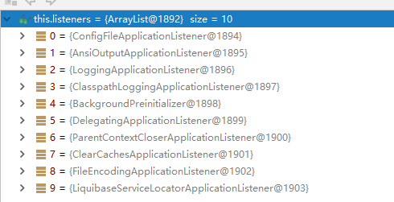

# 一、Spring Boot 入门

## 1、Spring Boot 简介

- 简化Spring应用开发的一个框架

- Spring技术栈的一个大整合

- J2EE开发的一站式解决方案

  

## 2、Spring Boot优点： 

- 快速创建独立运行的Spring项目以及与主流框架集成 
- 使用嵌入式的Servlet容器，应用无需打成WAR包 
- starters自动依赖与版本控制 
- 大量的自动配置，简化开发，也可修改默认值 
- 无需配置XML，无代码生成，开箱即用 
- 准生产环境的运行时应用监控 
- 与云计算的天然集成
- 

## 3、使用Spring Initializer快速创建Spring Boot项目

### 1、IDEA：使用 Spring Initializer快速创建项目


### 2、编写helloworld


### 3、项目文件目录结构


# 二、配置文件

## 1、配置文件

1、SpringBoot使用一个全局的配置文件，配置文件名是固定的；

•application.properties

•application.yml


2、相关依赖

```xml
<!--导入配置文件处理器，配置文件进行绑定就会有提示-->
	<dependency>
		<groupId>org.springframework.boot</groupId>
		<artifactId>spring-boot-configuration-processor</artifactId>
		<optional>true</optional>
	</dependency>
```

3、配置文件中文乱码的问题解决

​	本项目乱码解决


所有项目


4、配置文件的作用：修改SpringBoot自动配置的默认值；SpringBoot在底层都给我们自动配置好；

​	YAML：

```yaml
server:
  port: 8888
```

​	XML：

```xml
<server>
	<port>8888</port>
</server>
```


## 2、YAML语法：

### 1、基本语法

k:(空格)v ：表示一对键值对；

以**空格**的缩进来控制层级关系，并且大小写敏感；

```yaml
server:
    port: 8888
    path: /hello
```


### 2、值的写法

#### 字面量：普通的值（数字，字符串，布尔）

​	k: v

- ​		字符串默认不用加上单引号或者双引号；

- ​		""：双引号，不会转义字符串里面的特殊字符；

- ​		''：单引号；会转义特殊字符，时期变为普通的字符串


#### 对象、Map（属性和值）（键值对）：

​	k: v

​		在下一行来写对象的属性和值的关系；注意缩进

```yaml
person:
		name: hanhan
		age: 20
```

行内写法：

```yaml
person: {name: hanhan,age: 20}
```


#### 数组（List、Set）：

用- 值表示数组中的一个元素

```yaml
person:
 - hanhan
 - zhangsan
 - lisi
```

行内写法

```yaml
pets: [hanhan,zhangsan,lisi]
```


## 3、配置文件值注入

配置文件

```yaml
person:
		name: hanhan
		age: 20
```

javaBean：

```java
@Component /*加入到容器*/
@ConfigurationProperties(prefix = "person")
/*将本类中的所有属性和配置文件中相关的配置进行绑定；
 *prefix = "person"：配置文件中person下面的所有属性进行一一映射
 */
public class Person {

    private String name;
    private Integer age;


```


#### 1、@Value获取值和@ConfigurationProperties获取值比较

|            | @ConfigurationProperties | @Value |
| ---------- | ------------------------ | ------ |
| 功能         | 批量注入配置文件中的属性             | 一个个指定  |
| 松散绑定（松散语法） | 支持                       | 不支持    |
| SpEL       | 不支持                      | 支持     |
| JSR303数据校验 | 支持                       | 不支持    |
| 复杂类型封装     | 支持                       | 不支持    |

​	①获取一下配置文件中的某项值，使用@Value；

​	②编写javaBean来和配置文件进行映射，使用@ConfigurationProperties；


#### 2、@PropertySource&@ImportResource&@Bean

@**PropertySource**：加载指定的配置文件；

```java
@PropertySource(value = {"classpath:person.properties"})
@Component
public class Person {}
```


@**ImportResource**：导入Spring的配置文件，让配置文件里面的内容生效（注解在主程序上）；

```java
@ImportResource(locations = {"classpath:beans.xml"})
导入Spring的配置文件让其生效
```


SpringBoot推荐使用全注解的方式添加组件

```java

@Configuration	/*代替Spring配置文件*/
public class MyAppConfig {

    /*将方法的返回值添加到容器中；容器中这个组件默认的id就是方法名*/
    @Bean
    public HelloService helloService02(){
        System.out.println("配置类@Bean给容器中添加组件了...");
        return new HelloService();
    }
}
```

## 4、配置文件占位符的使用

### 随机数

```java
${random.value}
${random.int}
${random.long}
${random.int(100)}
${random.int[1,32767]}
```

```xml
person.age=${random.int}
```


## 5、Profile

### 1、多Profile文件

主配置文件编写的时候，文件名可以是   application-{profile}.properties/yml

默认使用application.properties的配置；


### 2、yml支持多文档块方式

```yml

server:
  port: 8088
spring:
  profiles:
    active: prod

---
server:
  port: 8888
spring:
  profiles: dev #指定属于哪个环境
```


### 3、激活指定profile三种方法

​	①在配置文件中指定  spring.profiles.active=dev

​	②命令行：java -jar spring-boot-02-config-0.0.1-SNAPSHOT.jar --spring.profiles.active=dev；

​	③虚拟机参数：-Dspring.profiles.active=dev


## 6、配置文件加载位置

springboot 启动会扫描以下位置的application.properties或者application.yml文件作为Spring boot的默认配置文件

–file:./config/

–file:./

–classpath:/config/

–classpath:/

优先级由高到底，高优先级的配置会覆盖低优先级的配置；

SpringBoot会从这四个位置全部加载主配置文件,**并且互补配置**；


## 7、外部配置加载顺序

**==SpringBoot也可以从以下位置加载配置； 优先级从高到低；高优先级的配置覆盖低优先级的配置，所有的配置会形成互补配置==**

**1.命令行参数**：java -jar spring-boot-02-config-02-0.0.1-SNAPSHOT.jar --server.port=8087 --配置项=值

2.来自java:comp/env的JNDI属性

3.Java系统属性（System.getProperties()）

4.操作系统环境变量

5.RandomValuePropertySource配置的random.*属性值

6.由jar包外向jar包内进行寻找配置文件，先加载带profile后加载不带profile

7.@Configuration注解类上的@PropertySource

8.通过SpringApplication.setDefaultProperties指定的默认属性


# 三、日志

## 1、日志框架

SpringBoot默认选用

​	日志的抽象层： SLF4j；

​	日志实现：Logback；

## 2、SLF4j使用

### 1、如何在系统中使用SLF4j   https://www.slf4j.org

日志记录方法的调用日志抽象层里面的方法，给系统里面导入slf4j的jar和  logback的实现jar

```java
import org.slf4j.Logger;
import org.slf4j.LoggerFactory;

public class HelloWorld {
  public static void main(String[] args) {
    Logger logger = LoggerFactory.getLogger(HelloWorld.class);
    logger.info("Hello World");
  }
}
```


## 3、SpringBoot日志关系：

​	1）、SpringBoot底层也是使用slf4j+logback的方式进行日志记录

​	2）、SpringBoot也把其他的日志都替换成了slf4j；	

​	3）、**SpringBoot能自动适配所有的日志，而且底层使用slf4j+logback的方式记录日志，引入其他框架的时候，只需要把这个框架依赖的日志框架排除掉即可；**

## 4、日志使用；

### 1、默认配置

SpringBoot默认配置好了日志；

```java
	//记录器
	Logger logger = LoggerFactory.getLogger(getClass());
	@Test
	public void contextLoads() {
		/*日志的级别：(由低到高)trace<debug<info<warn<error*/
		logger.trace("trace日志...");
		logger.debug("debug日志...");
		/*默认是info级别的，没有指定级别的就用默认规定的级别；root级别*/
		logger.info("info日志...");
		logger.warn("warn日志...");
		logger.error("error日志...");
	}
```

日志输出格式：

    	%d表示日期时间，
    	%thread表示线程名，
    	%-5level：级别从左显示5个字符宽度
    	%logger{50} 表示logger名字最长50个字符，否则按照句点分割。 
    	%msg：日志消息，
    	%n是换行符
修改日志的默认配置

```properties
logging.level.com.atguigu=trace

#logging.path=
# 不指定路径在当前项目下生成springboot.log日志
# 可以指定完整的路径；
#logging.file=G:/springboot.log

# 在当前磁盘的根路径下创建spring文件夹和里面的log文件夹；使用 spring.log 作为默认文件
logging.path=/spring/log

#  在控制台输出的日志的格式
logging.pattern.console=%d{yyyy-MM-dd} [%thread] %-5level %logger{50} - %msg%n
# 指定文件中日志输出的格式
logging.pattern.file=%d{yyyy-MM-dd} === [%thread] === %-5level === %logger{50} ==== %msg%n
```

| logging.file | logging.path | Example  | Description             |
| ------------ | ------------ | -------- | ----------------------- |
| (none)       | (none)       |          | 只在控制台输出                 |
| 指定文件名        | (none)       | my.log   | 输出日志到my.log文件           |
| (none)       | 指定目录         | /var/log | 输出到指定目录的 spring.log 文件中 |

### 2、指定配置

给类路径下放上每个日志框架自己的配置文件即可；

| Logging System          | Customization                                                |
| ----------------------- | ------------------------------------------------------------ |
| Logback                 | `logback-spring.xml`, `logback-spring.groovy`, `logback.xml` ,`logback.groovy` |
| Log4j2                  | `log4j2-spring.xml` ,`log4j2.xml`                            |
| JDK (Java Util Logging) | `logging.properties`                                         |

logback.xml：直接就被日志框架识别了；

**logback-spring.xml**：由SpringBoot解析日志配置，可以使用SpringBoot的高级Profile功能


## 5、切换日志框架

切换为log4j2

```xml
   <dependency>
            <groupId>org.springframework.boot</groupId>
            <artifactId>spring-boot-starter-web</artifactId>
            <exclusions>
                <exclusion>
                    <artifactId>spring-boot-starter-logging</artifactId>
                    <groupId>org.springframework.boot</groupId>
                </exclusion>
            </exclusions>
        </dependency>

<dependency>
  <groupId>org.springframework.boot</groupId>
  <artifactId>spring-boot-starter-log4j2</artifactId>
</dependency>
```

-----------------

# 四、Web开发


## 1、SpringBoot对静态资源的映射规则；


1）、	webjars：以jar包的方式引入静态资源，目录在 classpath:/META-INF/resources/webjars/ **下


```xml
<!--引入jquery-webjar-->
		<dependency>
			<groupId>org.webjars</groupId>
			<artifactId>jquery</artifactId>
			<version>3.3.1</version>
		</dependency>
```


2）、"/**" 访问当前项目的任何资源，都去（静态资源的文件夹）找映射

```
"classpath:/META-INF/resources/", 
"classpath:/resources/",
"classpath:/static/", 
"classpath:/public/" 
"/"：当前项目的根路径
```

3）、静态资源文件夹下的所有index.html页面；被"/**"映射；


## 2、模板引擎（Thymeleaf）


### 1、引入thymeleaf；

```xml
	
	<dependency>
			<groupId>org.springframework.boot</groupId>
			<artifactId>spring-boot-starter-thymeleaf</artifactId>
          	2.1.6
	</dependency>
   <!--切换thymeleaf版本（可选）-->
	<properties>
			<thymeleaf.version>3.0.10.RELEASE</thymeleaf.version>
			<thymeleaf-layout-dialect.version>2.3.0</thymeleaf-layout-dialect.version>
	</properties>
```


### 2、Thymeleaf使用

​	Thymeleaf能自动渲染classpath:/templates/路径下的html页面

使用：

1、导入thymeleaf的名称空间

```xml
<html lang="en" xmlns:th="http://www.thymeleaf.org">
```

2、使用thymeleaf语法；

```html
<!DOCTYPE html>
<html lang="en" xmlns:th="http://www.thymeleaf.org">
<head>
    <meta charset="UTF-8">
    <title>Title</title>
</head>
<body>
    <div th:text="${hello}">这是显示欢迎信息</div>
</body>
</html>
```

### 3、语法规则

1）、th：任意html属性；来替换原生属性的值

2）、常用操作表达式

```properties
${...}：获取变量值；

*{...}：选择表达式，和${}在功能上是一样；
  
#{...}：获取国际化内容

@{...}：定义URL；
    		
~{...}：片段引用表达式
```


### 4.模板引擎修改后实时生效

1）、禁用模板引擎的缓存

```
# 禁用缓存
spring.thymeleaf.cache=false 
```

2）、页面修改完成以后ctrl+f9：重新编译；


### 5.thymeleaf公共页面元素抽取

```html
1、抽取公共片段
<div th:fragment="copy">
	公共片段
</div>

2、引入公共片段
<div th:insert="~{footer :: copy}"></div>
~{templatename::selector}：模板名::选择器
~{templatename::fragmentname}:模板名::片段名
```


三种引入公共片段的th属性：

**th:insert**：将公共片段整个插入到声明引入的元素中

**th:replace**：将声明引入的元素替换为公共片段

**th:include**：将被引入的片段的内容包含进这个标签中


```html
<footer th:fragment="copy">
	公共片段
</footer>

引入方式
<div th:insert="footer :: copy"></div>
<div th:replace="footer :: copy"></div>
<div th:include="footer :: copy"></div>

<div>
    <footer>
        效果一
    </footer>
</div>

<footer>
	效果二
</footer>

<div>
	效果三
</div>
```


## 3、SpringMVC自动配置


### 1. Spring MVC auto-configuration

Spring Boot 自动配置好了SpringMVC

SpringBoot对SpringMVC的默认配置:**（WebMvcAutoConfiguration）**

- 自动配置了ViewResolver（视图解析器：根据方法的返回值得到视图对象，视图对象决定如何渲染（转发或者重定向））
  
- 静态资源文件夹路径,webjars

- 静态首页访问

- favicon.ico

- 自动注册了  `Converter`, `GenericConverter`, `Formatter` beans.

  - Converter：转换器； 
  - `Formatter`  格式化器，自己添加的格式化器转换器，我们只需要放在容器中即可

- Support for `HttpMessageConverters` (see below).

  - HttpMessageConverter：SpringMVC用来转换Http请求和响应的；

  - `HttpMessageConverters` 是从容器中确定；获取所有的HttpMessageConverter；

    自己给容器中添加HttpMessageConverter，只需要将自己的组件注册容器中（@Bean,@Component）

- 定义错误代码生成规则

- 我们可以配置一个ConfigurableWebBindingInitializer来替换默认的；


### 2、扩展SpringMVC

​	**编写一个配置类（@Configuration），是WebMvcConfigurerAdapter类型；不能标注@EnableWebMvc**;

保留自动配置的前提下使用自定义的配置；

```java
@Configuration	/*添加自定义mvc配置*/
//@EnableWebMvc：使自动配置失效
public class SpringMvcConfig extends WebMvcConfigurerAdapter {

    @Override
    public void addViewControllers(ViewControllerRegistry registry) {
        //浏览器发送 /index 请求来到 login
        registry.addViewController("/index").setViewName("login");
    }
}
```


## 4、RestfulCRUD

### 1）、将首页设为登陆界面

```java
@Configuration
public class MyMvcConfig extends WebMvcConfigurerAdapter {
  
    //所有的WebMvcConfigurerAdapter组件都会一起起作用
    @Bean /*将组件注册在容器*/
    public WebMvcConfigurerAdapter webMvcConfigurerAdapter(){
        WebMvcConfigurerAdapter adapter = new WebMvcConfigurerAdapter() {
            @Override
            public void addViewControllers(ViewControllerRegistry registry) {
                registry.addViewController("/").setViewName("login");
                registry.addViewController("/index.html").setViewName("login");
            }
        };
        return adapter;
    }
}
```

### 2）、国际化

**1）、编写国际化配置文件；**

2）、使用ResourceBundleMessageSource管理国际化资源文件

3）、在页面使用fmt:message取出国际化内容


步骤：

1）、编写国际化配置文件，抽取页面需要显示的国际化消息


2）、SpringBoot自动配置了管理国际化资源文件的组件；

3）、去页面获取国际化的值；

```html
<!doctype html>
<html lang="en">
<html lang="en" xmlns:th="http://www.thymeleaf.org">
<head>
    <meta charset="UTF-8" />
    <title>Document</title>
    <link rel="stylesheet" href="../../static/bootstrap-3.3.7/css/bootstrap.css" th:href="@{/webjars/bootstrap/3.3.7/css/bootstrap.css}">
    <script src="../../static/js/jquery-1.12.4.min.js" th:src="@{/webjars/jquery/3.3.1/jquery.js}"></script>
    <script src="../../static/bootstrap-3.3.7/js/bootstrap.min.js" th:src="@{/webjars/bootstrap/3.3.7/js/bootstrap.js}"></script>
</head>

<body>

<div class="main" >
    <!--导航条-->
    <div th:replace="commons/demo :: topBar"></div>

    <div class="content">
        <form action="../index.html" th:action="@{/login}" method="post">
            <span class="padding2"></span>
            <input type="text" name="username" placeholder="userName" class="padding" th:placeholder="#{login.username}">
            <input type="password" name="password" placeholder="password" class="padding" th:placeholder="#{login.password}">
            <span class="helpMessage" th:text="${msg}"></span>
            <br><br>
            <input type="submit" class="demo" value="login" th:value="#{login.tip}">
            <p class="forget"><a href="forget.html" th:text="#{login.forget}">forget Password</a></p>
            <p class="register"><a href="register.html" th:text="#{login.register}">Register</a></p>

            <a class="btn btn-sm" th:href="@{/templates/index.html(l='zh_CN')}">中文</a>
            <a class="btn btn-sm" th:href="@{/templates/index.html(l='en_US')}">English</a>
        </form>

    </div>
</div>

</body>

```


4）、点击链接切换国际化

```java
/* 可以在连接上携带区域信息*/
public class LocaleResolver implements LocaleResolver {
    
    @Override
    public Locale resolveLocale(HttpServletRequest request) {
        String l = request.getParameter("l");
        Locale locale = Locale.getDefault();
        if(!StringUtils.isEmpty(l)){
            String[] split = l.split("_");
            locale = new Locale(split[0],split[1]);
        }
        return locale;
    }

    @Override
    public void setLocale(HttpServletRequest request, HttpServletResponse response, Locale locale) {

    }
}

/*在SpringMvcConfig中添加组件*/
 @Bean
    public LocaleResolver localeResolver(){
        return new MyLocaleResolver();
    }
}
```


### 3）、拦截器进行登陆检查

1）、拦截器

```java

/**
 * @author LFuser
 * @create 2019-10-23-下午 9:05
 * 登陆检查拦截器
 */
public class LoginHandlerInterceptor implements HandlerInterceptor {
    //目标方法执行之前
    @Override
    public boolean preHandle(HttpServletRequest request, HttpServletResponse response, Object handler) throws Exception {
        Object user = request.getSession().getAttribute("loginUser");
        if(user == null){
            //未登陆，返回登陆页面
            request.setAttribute("msg","没有权限请先登陆");
            request.getRequestDispatcher("/index.html").forward(request,response);
            return false;
        }else{
            //已登陆，放行请求
            return true;
        }
    }

    @Override
    public void postHandle(HttpServletRequest request, HttpServletResponse response, Object handler, ModelAndView modelAndView) throws Exception {

    }

    @Override
    public void afterCompletion(HttpServletRequest request, HttpServletResponse response, Object handler, Exception ex) throws Exception {

    }
}

```


2）、注册拦截器

```java
	@Bean 
    public WebMvcConfigurerAdapter webMvcConfigurerAdapter(){
        WebMvcConfigurerAdapter adapter = new WebMvcConfigurerAdapter() {
            @Override
            public void addViewControllers(ViewControllerRegistry registry) {...}

    //注册拦截器
            @Override
            public void addInterceptors(InterceptorRegistry registry) {
                registry.addInterceptor(new LoginHandlerInterceptor()).addPathPatterns("/**")
                        .excludePathPatterns("/index.html","/","/login");
            }
        };
        return adapter;
    }
```

### 4）、CRUD-员工列表

实验要求：

1）、RestfulCRUD：CRUD满足Rest风格；

URI：  /资源名称/资源标识       HTTP请求方式区分对资源CRUD操作

|      | 普通CRUD（uri来区分操作） | RestfulCRUD       |
| ---- | ------------------------- | ----------------- |
| 查询 | getEmp                    | emp---GET         |
| 添加 | addEmp?xxx                | emp---POST        |
| 修改 | updateEmp?id=xxx&xxx=xx   | emp/{id}---PUT    |
| 删除 | deleteEmp?id=1            | emp/{id}---DELETE |


### 5）、CRUD-员工添加

添加页面

```html
<form>
    <div class="form-group">
        <label>LastName</label>
        <input type="text" class="form-control" placeholder="username">
    </div>
    <div class="form-group">
        <label>Email</label>
        <input type="email" class="form-control" placeholder="email">
    </div>
    <div class="form-group">
        <label>Gender</label><br/>
        <div class="form-check form-check-inline">
            <input class="form-check-input" type="radio" name="gender"  value="1">
            <label class="form-check-label">男</label>
        </div>
        <div class="form-check form-check-inline">
            <input class="form-check-input" type="radio" name="gender"  value="0">
            <label class="form-check-label">女</label>
        </div>
    </div>
    <div class="form-group">
        <label>department</label>
        <select class="form-control">
            <option>1</option>
            <option>2</option>
            <option>3</option>
        </select>
    </div>
    <div class="form-group">
        <label>Birth</label>
        <input type="text" class="form-control" placeholder="birth">
    </div>
    <button type="submit" class="btn btn-primary">添加</button>
</form>
```


### 7）、CRUD-员工修改

修改添加二合一表单

```html
<!--需要区分是员工修改还是添加；-->
<form th:action="@{/emp}" method="post">
    <!--发送put请求修改员工数据-->
    <!--
1、SpringMVC中配置HiddenHttpMethodFilter;（SpringBoot自动配置好的）
2、页面创建一个post表单
3、创建一个input项，name="_method";值就是我们指定的请求方式
-->
    <input type="hidden" name="_method" value="put" th:if="${emp!=null}"/>
    <input type="hidden" name="id" th:if="${emp!=null}" th:value="${emp.id}">
    <div class="form-group">
        <label>LastName</label>
        <input name="lastName" type="text" class="form-control" placeholder="zhangsan" th:value="${emp!=null}?${emp.lastName}">
    </div>
    <div class="form-group">
        <label>Email</label>
        <input name="email" type="email" class="form-control" placeholder="zhangsan@atguigu.com" th:value="${emp!=null}?${emp.email}">
    </div>
    <div class="form-group">
        <label>Gender</label><br/>
        <div class="form-check form-check-inline">
            <input class="form-check-input" type="radio" name="gender" value="1" th:checked="${emp!=null}?${emp.gender==1}">
            <label class="form-check-label">男</label>
        </div>
        <div class="form-check form-check-inline">
            <input class="form-check-input" type="radio" name="gender" value="0" th:checked="${emp!=null}?${emp.gender==0}">
            <label class="form-check-label">女</label>
        </div>
    </div>
    <div class="form-group">
        <label>department</label>
        <!--提交的是部门的id-->
        <select class="form-control" name="department.id">
            <option th:selected="${emp!=null}?${dept.id == emp.department.id}" th:value="${dept.id}" th:each="dept:${depts}" th:text="${dept.departmentName}">1</option>
        </select>
    </div>
    <div class="form-group">
        <label>Birth</label>
        <input name="birth" type="text" class="form-control" placeholder="zhangsan" th:value="${emp!=null}?${#dates.format(emp.birth, 'yyyy-MM-dd HH:mm')}">
    </div>
    <button type="submit" class="btn btn-primary" th:text="${emp!=null}?'修改':'添加'">添加</button>
</form>
```

### 8）、CRUD-员工删除

```html
<tr th:each="emp:${emps}">
    <td th:text="${emp.id}"></td>
    <td>[[${emp.lastName}]]</td>
    <td th:text="${emp.email}"></td>
    <td th:text="${emp.gender}==0?'女':'男'"></td>
    <td th:text="${emp.department.departmentName}"></td>
    <td th:text="${#dates.format(emp.birth, 'yyyy-MM-dd HH:mm')}"></td>
    <td>
        <a class="btn btn-sm btn-primary" th:href="@{/emp/}+${emp.id}">编辑</a>
        <button th:attr="del_uri=@{/emp/}+${emp.id}" class="btn btn-sm btn-danger deleteBtn">删除</button>
    </td>
</tr>


<script>
    $(".deleteBtn").click(function(){
        //删除当前员工的
        $("#deleteEmpForm").attr("action",$(this).attr("del_uri")).submit();
        return false;
    });
</script>
```


## 5、错误处理机制


### 1）、定制错误响应：

#### 	**1）、定制错误的页面；**

​			1）、有模板引擎的情况下: error/状态码; 【将错误页面命名为  错误状态码.html 放在模板引擎文件夹里面的 error文件夹下】，发生此状态码的错误就会来到  对应的页面,可以用4xx和5xx作为错误页面的文件名来匹配这种类型的所有错误，精确优先

​			页面能获取的信息；

​				timestamp：时间戳

​				status：状态码

​				error：错误提示

​				exception：异常对象

​				message：异常消息

​				errors：JSR303数据校验的错误

​			2）、没有模板引擎（模板引擎找不到这个错误页面），静态资源文件夹下找；

​			3）、以上都没有错误页面，就是默认来到SpringBoot默认的错误提示页面；


#### 	2）、定制错误的json数据；(可选)

​		1）、自定义异常处理&返回定制json数据；

```java
@ControllerAdvice
public class MyExceptionHandler {

    @ResponseBody
    @ExceptionHandler(UserNotExistException.class)
    public Map<String,Object> handleException(Exception e){
        Map<String,Object> map = new HashMap<>();
        map.put("code","freeError");
        return map;
    }
}
```


​		2）、转发到/error进行自适应响应效果处理

```java
 @ExceptionHandler(UserNotExistException.class)
    public String handleException(Exception e, HttpServletRequest request){
        Map<String,Object> map = new HashMap<>();
        //传入错误状态码  4xx 5xx，否则就不会进入定制错误页面的解析流程
        request.setAttribute("javax.servlet.error.status_code",500);
        map.put("code","freeError");
        //转发到/error
        return "forward:/error";
    }
```

#### 	3）、将定制数据携带出去(可选)

​	1、完全来编写一个ErrorController的实现类【或者是编写AbstractErrorController的子类】，放在容器中.

​	2、页面上能用的数据，或者是json返回能用的数据都是通过errorAttributes.getErrorAttributes得到,

​			容器中DefaultErrorAttributes.getErrorAttributes(),默认进行数据处理的；

```java
//给容器中加入我们自己定义的ErrorAttributes
@Component
public class MyErrorAttributes extends DefaultErrorAttributes {

    @Override
    public Map<String, Object> getErrorAttributes(RequestAttributes requestAttributes, boolean includeStackTrace) {
        Map<String, Object> map = super.getErrorAttributes(requestAttributes, includeStackTrace);
        map.put("country","China");
        return map;
    }
}
```


## 6、配置嵌入式Servlet容器

SpringBoot默认使用Tomcat作为嵌入式的Servlet容器；

### 1）、定制和修改Servlet容器的相关配置；

1、修改和server有关的配置

```properties
#通用的Servlet容器设置server.xxx
server.port=8888
server.context-path=/arcadia

#Tomcat的设置server.tomcat.xxx
server.tomcat.uri-encoding=UTF-8
```

2、编写一个**EmbeddedServletContainerCustomizer**：嵌入式的Servlet容器的定制器

```java
@Bean
public EmbeddedServletContainerCustomizer embeddedServletContainerCustomizer(){
    return new EmbeddedServletContainerCustomizer() {
        //定制嵌入式的Servlet容器相关的规则
        @Override
        public void customize(ConfigurableEmbeddedServletContainer container) {
            container.setPort(8888);
        }
    };
}
```

### 2）、注册Servlet三大组件【Servlet、Filter、Listener】

1）、ServletRegistrationBean(注册自定义的Servlet)

```java
//注册三大组件
@Bean
public ServletRegistrationBean myServlet(){
    ServletRegistrationBean registrationBean = new ServletRegistrationBean(new MyServlet(),"/myServlet");
    return registrationBean;
}

```

2）、FilterRegistrationBean(注册自定义的Filter)

```java
@Bean
public FilterRegistrationBean myFilter(){
    FilterRegistrationBean registrationBean = new FilterRegistrationBean();
    registrationBean.setFilter(new MyFilter());
    registrationBean.setUrlPatterns(Arrays.asList("/hello","/myServlet"));
    return registrationBean;
}
```

3）、ServletListenerRegistrationBean(注册自定义的Listener)

```java
@Bean
public ServletListenerRegistrationBean myListener(){
    ServletListenerRegistrationBean<MyListener> registrationBean = new ServletListenerRegistrationBean<>(new MyListener());
    return registrationBean;
}
```


### 3）、替换为其他嵌入式Servlet容器

默认支持：

Tomcat（默认使用）

```xml
<!--引入web模块默认就是使用嵌入式的Tomcat作为Servlet容器；-->
<dependency>
   <groupId>org.springframework.boot</groupId>
   <artifactId>spring-boot-starter-web</artifactId>
</dependency>
```

Jetty

```xml
<!-- 引入web模块 -->
<dependency>
   <groupId>org.springframework.boot</groupId>
   <artifactId>spring-boot-starter-web</artifactId>
   <exclusions>
      <exclusion>
         <artifactId>spring-boot-starter-tomcat</artifactId>
         <groupId>org.springframework.boot</groupId>
      </exclusion>
   </exclusions>
</dependency>

<!--引入其他的Servlet容器-->
<dependency>
   <artifactId>spring-boot-starter-jetty</artifactId>
   <groupId>org.springframework.boot</groupId>
</dependency>
```


### 4）、嵌入式Servlet容器自动配置原理；

步骤：

1）、SpringBoot根据导入的依赖情况，给容器中添加相应的EmbeddedServletContainerFactory【TomcatEmbeddedServletContainerFactory】

2）、容器中某个组件要创建对象就会惊动后置处理器；EmbeddedServletContainerCustomizerBeanPostProcessor；

只要是嵌入式的Servlet容器工厂，后置处理器就工作；

3）、后置处理器，从容器中获取所有的**EmbeddedServletContainerCustomizer**，调用定制器的定制方法


### 5）、嵌入式Servlet容器启动原理；

1）、SpringBoot应用启动运行run方法

2）、refreshContext(context);SpringBoot刷新IOC容器【创建IOC容器对象，并初始化容器，创建容器中的每一个组件】；如果是web应用创建**AnnotationConfigEmbeddedWebApplicationContext**，否则：**AnnotationConfigApplicationContext**

3）、refresh(context);**刷新刚才创建好的ioc容器；**

4）、  onRefresh(); web的ioc容器重写了onRefresh方法

5）、webioc容器会创建嵌入式的Servlet容器；**createEmbeddedServletContainer**();

**6）、获取嵌入式的Servlet容器工厂：**

EmbeddedServletContainerFactory containerFactory = getEmbeddedServletContainerFactory();

​	从ioc容器中获取EmbeddedServletContainerFactory 组件；**TomcatEmbeddedServletContainerFactory**创建对象，后置处理器一看是这个对象，就获取所有的定制器来先定制Servlet容器的相关配置；

7）、**使用容器工厂获取嵌入式的Servlet容器**：this.embeddedServletContainer = containerFactory      .getEmbeddedServletContainer(getSelfInitializer());

8）、嵌入式的Servlet容器创建对象并启动Servlet容器；

**先启动嵌入式的Servlet容器，再将ioc容器中剩下没有创建出的对象获取出来,IOC容器启动创建嵌入式的Servlet容器**


## 7、使用外置的Servlet容器步骤

1）、创建一个war项目

2）、将嵌入式的Tomcat指定为provided

```xml
<dependency>
   <groupId>org.springframework.boot</groupId>
   <artifactId>spring-boot-starter-tomcat</artifactId>
   <scope>provided</scope>
</dependency>
```

3）、编写一个**SpringBootServletInitializer**的子类，并调用configure方法

```java
public class ServletInitializer extends SpringBootServletInitializer {
   @Override
   protected SpringApplicationBuilder configure(SpringApplicationBuilder application) {
       //传入SpringBoot应用的主程序
      return application.sources(SpringBoot04WebJspApplication.class);
   }

}
```

4）、启动服务器就可以使用；

# 五、Docker

## 1、简介

**Docker**是一个开源的应用容器引擎；是一个轻量级容器技术；

Docker支持将软件编译成一个镜像；然后在镜像中各种软件做好配置，将镜像发布出去，其他使用者可以直接使用这个镜像；

运行中的这个镜像称为容器，容器启动是非常快速的。


## 2、核心概念

docker主机(Host)：安装了Docker程序的机器（Docker直接安装在操作系统之上）；

docker客户端(Client)：连接docker主机进行操作；

docker仓库(Registry)：用来保存各种打包好的软件镜像；

docker镜像(Images)：软件打包好的镜像；放在docker仓库中；

docker容器(Container)：镜像启动后的实例称为一个容器；容器是独立运行的一个或一组应用


使用Docker的步骤：

1）、安装Docker

2）、去Docker仓库找到这个软件对应的镜像；

3）、使用Docker运行这个镜像，这个镜像就会生成一个Docker容器；

4）、对容器的启动停止就是对软件的启动停止；

## 3、安装Docker

#### 1）、安装linux虚拟机

​	1）、VMWare、VirtualBox（安装）；

​	2）、导入虚拟机文件centos7-atguigu.ova；

​	3）、双击启动linux虚拟机;使用  root/ 123456登陆

​	4）、使用客户端连接linux服务器进行命令操作；

​	5）、设置虚拟机网络；

​		桥接网络===选好网卡====接入网线；

​	6）、设置好网络以后使用命令重启虚拟机的网络

```shell
service network restart
```

​	7）、查看linux的ip地址

```shell
ip addr
```

​	8）、使用客户端连接linux；

#### 2）、在linux虚拟机上安装docker

步骤：

```shell
1、检查内核版本，必须是3.10及以上
uname -r
2、安装docker
yum install docker
3、输入y确认安装
4、启动docker
[root@localhost ~]# systemctl start docker
[root@localhost ~]# docker -v
Docker version 1.12.6, build 3e8e77d/1.12.6
5、开机启动docker
[root@localhost ~]# systemctl enable docker
Created symlink from /etc/systemd/system/multi-user.target.wants/docker.service to /usr/lib/systemd/system/docker.service.
6、停止docker
systemctl stop docker
```

## 4、Docker常用命令&操作

### 1）、镜像操作

| 操作 | 命令                                            | 说明                                                     |
| ---- | ----------------------------------------------- | -------------------------------------------------------- |
| 检索 | docker  search 关键字  eg：docker  search redis | 我们经常去docker  hub上检索镜像的详细信息，如镜像的TAG。 |
| 拉取 | docker pull 镜像名:tag                          | :tag是可选的，tag表示标签，多为软件的版本，默认是latest  |
| 列表 | docker images                                   | 查看所有本地镜像                                         |
| 删除 | docker rmi image-id                             | 删除指定的本地镜像                                       |

https://hub.docker.com/

### 2）、容器操作

软件镜像（QQ安装程序）----运行镜像----产生一个容器（正在运行的软件，运行的QQ）；

步骤：

````shell
1、搜索镜像
[root@localhost ~]# docker search tomcat
2、拉取镜像
[root@localhost ~]# docker pull tomcat
3、根据镜像启动容器
docker run --name mytomcat -d tomcat:latest
4、docker ps  
查看运行中的容器
5、 停止运行中的容器
docker stop  容器的id
6、查看所有的容器
docker ps -a
7、启动容器
docker start 容器id
8、删除一个容器
 docker rm 容器id
9、启动一个做了端口映射的tomcat
[root@localhost ~]# docker run -d -p 8888:8080 tomcat
-d：后台运行
-p: 将主机的端口映射到容器的一个端口    主机端口:容器内部的端口

10、为了演示简单关闭了linux的防火墙
service firewalld status ；查看防火墙状态
service firewalld stop：关闭防火墙
11、查看容器的日志
docker logs container-name/container-id

更多命令参看
https://docs.docker.com/engine/reference/commandline/docker/
可以参考每一个镜像的文档

````


### 3）、安装MySQL示例

```shell
docker pull mysql
```


错误的启动

```shell
[root@localhost ~]# docker run --name mysql01 -d mysql
42f09819908bb72dd99ae19e792e0a5d03c48638421fa64cce5f8ba0f40f5846

mysql退出了
[root@localhost ~]# docker ps -a
CONTAINER ID        IMAGE               COMMAND                  CREATED             STATUS                           PORTS               NAMES
42f09819908b        mysql               "docker-entrypoint.sh"   34 seconds ago      Exited (1) 33 seconds ago                            mysql01
538bde63e500        tomcat              "catalina.sh run"        About an hour ago   Exited (143) About an hour ago                       compassionate_
goldstine
c4f1ac60b3fc        tomcat              "catalina.sh run"        About an hour ago   Exited (143) About an hour ago                       lonely_fermi
81ec743a5271        tomcat              "catalina.sh run"        About an hour ago   Exited (143) About an hour ago                       sick_ramanujan


//错误日志
[root@localhost ~]# docker logs 42f09819908b
error: database is uninitialized and password option is not specified 
  You need to specify one of MYSQL_ROOT_PASSWORD, MYSQL_ALLOW_EMPTY_PASSWORD and MYSQL_RANDOM_ROOT_PASSWORD；这个三个参数必须指定一个
```

正确的启动

```shell
[root@localhost ~]# docker run --name mysql01 -e MYSQL_ROOT_PASSWORD=123456 -d mysql
b874c56bec49fb43024b3805ab51e9097da779f2f572c22c695305dedd684c5f
[root@localhost ~]# docker ps
CONTAINER ID        IMAGE               COMMAND                  CREATED             STATUS              PORTS               NAMES
b874c56bec49        mysql               "docker-entrypoint.sh"   4 seconds ago       Up 3 seconds        3306/tcp            mysql01
```

做了端口映射

```shell
[root@localhost ~]# docker run -p 3306:3306 --name mysql02 -e MYSQL_ROOT_PASSWORD=123456 -d mysql
ad10e4bc5c6a0f61cbad43898de71d366117d120e39db651844c0e73863b9434
[root@localhost ~]# docker ps
CONTAINER ID        IMAGE               COMMAND                  CREATED             STATUS              PORTS                    NAMES
ad10e4bc5c6a        mysql               "docker-entrypoint.sh"   4 seconds ago       Up 2 seconds        0.0.0.0:3306->3306/tcp   mysql02
```


几个其他的高级操作

```
docker run --name mysql03 -v /conf/mysql:/etc/mysql/conf.d -e MYSQL_ROOT_PASSWORD=my-secret-pw -d mysql:tag
把主机的/conf/mysql文件夹挂载到 mysqldocker容器的/etc/mysql/conf.d文件夹里面
改mysql的配置文件就只需要把mysql配置文件放在自定义的文件夹下（/conf/mysql）

docker run --name some-mysql -e MYSQL_ROOT_PASSWORD=my-secret-pw -d mysql:tag --character-set-server=utf8mb4 --collation-server=utf8mb4_unicode_ci
指定mysql的一些配置参数
```


# 六、SpringBoot与数据访问

## 1、JDBC

```xml
		<dependency>
			<groupId>org.springframework.boot</groupId>
			<artifactId>spring-boot-starter-jdbc</artifactId>
		</dependency>
		<dependency>
			<groupId>mysql</groupId>
			<artifactId>mysql-connector-java</artifactId>
			<scope>runtime</scope>
		</dependency>
```


```yaml
spring:
  datasource:
    username: root
    password: LF@0827
    url: jdbc:mysql://localhost:3306/jdbc?serverTimezone=UTC
    driver-class-name: com.mysql.cj.jdbc.Driver
```

效果：

​	默认是用org.apache.tomcat.jdbc.pool.DataSource作为数据源；

​	数据源的相关配置都在DataSourceProperties里面；

## 2、整合Druid数据源

1）、添加Druid依赖

```xml
<!-- Druid数据源 -->
<dependency>    
    <groupId>com.alibaba</groupId>    
    <artifactId>druid-spring-boot-starter</artifactId>    
    <version>1.1.16</version>
</dependency>
```

2）、编写yml配置文件

```yaml
spring:
  datasource:
    username: root
    password: LF@0827
    url: jdbc:mysql://localhost:3306/jdbc?serverTimezone=UTC
    driver-class-name: com.mysql.cj.jdbc.Driver
    type: com.alibaba.druid.pool.DruidDataSource

    # 初始化大小，最小，最大
    initialSize: 5
    minIdle: 5
    maxActive: 20                         #最大并发连接数

    maxWait: 60000                        # 配置获取连接等待超时的时间
    timeBetweenEvictionRunsMillis: 60000  # 配置间隔多久才进行一次检测，检测需要关闭的空闲连接，单位是毫秒
    minEvictableIdleTimeMillis: 300000    # 配置一个连接在池中最小生存的时间，单位是毫秒

    validationQuery: SELECT 1 FROM DUAL   # 检测连接是否有效的sql
    testWhileIdle: true
    testOnBorrow: false
    testOnReturn: false
    poolPreparedStatements: true

    filters: stat,wall                  #   配置监控统计拦截的filters，去掉后监控界面sql无法统计，'wall'用于防火墙
    maxPoolPreparedStatementPerConnectionSize: 20
    useGlobalDataSourceStat: true                      # 合并多个DruidDataSource的监控数据
    connectionProperties: druid.stat.mergeSql=true;druid.stat.slowSqlMillis=500 # 通过connectProperties属性来打开mergeSql功能；慢SQL记录
```


3）、编写DruidConfig：导入Druid数据源，并配置Druid的监控

```java
@Configuration
public class DruidConfig {
    //导入Druid数据源
    @ConfigurationProperties(prefix = "spring.datasource")
    @Bean
    public DataSource druid(){
        return  new DruidDataSource();
    }

    //配置Druid的监控
    //1、配置一个管理后台的Servlet
    @Bean
    public ServletRegistrationBean statViewServlet(){
        ServletRegistrationBean bean = new ServletRegistrationBean(new StatViewServlet(), "/druid/*");
        Map<String,String> initParams = new HashMap<>();

        initParams.put("loginUsername","arcadia");
        initParams.put("loginPassword","arcadia");
        initParams.put("allow","");//默认就是允许所有访问
//        initParams.put("deny","");//拒绝此地址访问

        bean.setInitParameters(initParams);
        return bean;
    }


    //2、配置一个web监控的filter
    @Bean
    public FilterRegistrationBean webStatFilter(){
        FilterRegistrationBean bean = new FilterRegistrationBean();
        bean.setFilter(new WebStatFilter());

        Map<String,String> initParams = new HashMap<>();
        initParams.put("exclusions","*.js,*.css,/druid/*");//不拦截的请求

        bean.setInitParameters(initParams);

        bean.setUrlPatterns(Arrays.asList("/*"));//拦截所有请求

        return  bean;
    }
}

```

4）、进入Druid数据源的监控


## 3、整合MyBatis

```xml
		<dependency>
            <groupId>org.mybatis.spring.boot</groupId>
            <artifactId>mybatis-spring-boot-starter</artifactId>
            <version>2.1.1</version>
        </dependency>
```


步骤：

​	1）、配置数据源相关属性

​	2）、给数据库建表

​	3）、创建JavaBean

### 	4）、注解版

```java
//指定这是一个操作数据库的mapper
@Mapper
public interface testMapper {

    @Select("select * from test where name=#{name}")
    public test getTestByName(String name);

    @Delete("delete from test where name=#{name}")
    public int deleteTestByName(String name);

    @Options(useGeneratedKeys = true,keyProperty = "name")
    @Insert("insert into test values(#{name},#{age})")
    public int insertTest(test t);

    @Update("update test set age=#{age} where name=#{name}")
    public int updateTest(test t);
}
```


自定义MyBatis的配置配置文件

```java
@org.springframework.context.annotation.Configuration
public class MyBatisConfig {

    @Bean
    public ConfigurationCustomizer configurationCustomizer(){
        return new ConfigurationCustomizer(){

            @Override
            public void customize(Configuration configuration) {
                //驼峰命名规则
                configuration.setMapUnderscoreToCamelCase(true);
            }
        };
    }
}
```


使用@MapperScan批量扫描所有的Mapper接口

```java
@MapperScan(value = "com.aurora.arcadia.mapper")
@SpringBootApplication
public class SpringBootApplication {

	public static void main(String[] args) {
		SpringApplication.run(SpringBootApplication.class, args);
	}
}
```

### 5）、配置文件版

```yaml
mybatis:
  config-location: classpath:mybatis/mybatis-config.xml 	#指定全局配置文件的位置
  mapper-locations: classpath:mybatis/mapper/*.xml  		#指定sql映射文件的位置
```


## 4、整合SpringData JPA

### 1）、SpringData简介


### 2）、整合SpringData JPA

JPA:ORM（Object Relational Mapping）；

1）、编写一个实体类（bean）和数据表进行映射，并且配置好映射关系；

```java
//使用JPA注解配置映射关系
@Entity //告诉JPA这是一个实体类（和数据表映射的类）
@Table(name = "tbl_user") //@Table来指定和哪个数据表对应;如果省略默认表名就是user；
public class User {

    @Id //这是一个主键
    @GeneratedValue(strategy = GenerationType.IDENTITY)//自增主键
    private Integer id;

    @Column(name = "last_name",length = 50) //这是和数据表对应的一个列
    private String lastName;
    @Column //省略默认列名就是属性名
    private String email;
```

2）、编写一个Dao接口来操作实体类对应的数据表（Repository）

```java
//继承JpaRepository来完成对数据库的操作
public interface UserRepository extends JpaRepository<User,Integer> {
}

```

3）、基本的配置JpaProperties

```yaml
spring:  
 jpa:
    hibernate:
#     更新或者创建数据表结构
      ddl-auto: update
#    控制台显示SQL
    show-sql: true
```


# 七、启动配置原理

几个重要的事件回调机制

配置在META-INF/spring.factories

**ApplicationContextInitializer**

**SpringApplicationRunListener**


只需要放在ioc容器中

**ApplicationRunner**

**CommandLineRunner**


启动流程：

## **1、创建SpringApplication对象**

```java
initialize(sources);
private void initialize(Object[] sources) {
    //保存主配置类
    if (sources != null && sources.length > 0) {
        this.sources.addAll(Arrays.asList(sources));
    }
    //判断当前是否一个web应用
    this.webEnvironment = deduceWebEnvironment();
    //从类路径下找到META-INF/spring.factories配置的所有ApplicationContextInitializer；然后保存起来
    setInitializers((Collection) getSpringFactoriesInstances(
        ApplicationContextInitializer.class));
    //从类路径下找到ETA-INF/spring.factories配置的所有ApplicationListener
    setListeners((Collection) getSpringFactoriesInstances(ApplicationListener.class));
    //从多个配置类中找到有main方法的主配置类
    this.mainApplicationClass = deduceMainApplicationClass();
}
```




## 2、运行run方法

```java
public ConfigurableApplicationContext run(String... args) {
   StopWatch stopWatch = new StopWatch();
   stopWatch.start();
   ConfigurableApplicationContext context = null;
   FailureAnalyzers analyzers = null;
   configureHeadlessProperty();
    
   //获取SpringApplicationRunListeners；从类路径下META-INF/spring.factories
   SpringApplicationRunListeners listeners = getRunListeners(args);
    //回调所有的获取SpringApplicationRunListener.starting()方法
   listeners.starting();
   try {
       //封装命令行参数
      ApplicationArguments applicationArguments = new DefaultApplicationArguments(
            args);
      //准备环境
      ConfigurableEnvironment environment = prepareEnvironment(listeners,
            applicationArguments);
       		//创建环境完成后回调SpringApplicationRunListener.environmentPrepared()；表示环境准备完成
       
      Banner printedBanner = printBanner(environment);
       
       //创建ApplicationContext；决定创建web的ioc还是普通的ioc
      context = createApplicationContext();
       
      analyzers = new FailureAnalyzers(context);
       //准备上下文环境;将environment保存到ioc中；而且applyInitializers()；
       //applyInitializers()：回调之前保存的所有的ApplicationContextInitializer的initialize方法
       //回调所有的SpringApplicationRunListener的contextPrepared()；
       //
      prepareContext(context, environment, listeners, applicationArguments,
            printedBanner);
       //prepareContext运行完成以后回调所有的SpringApplicationRunListener的contextLoaded（）；
       
       //s刷新容器；ioc容器初始化（如果是web应用还会创建嵌入式的Tomcat）；Spring注解版
       //扫描，创建，加载所有组件的地方；（配置类，组件，自动配置）
      refreshContext(context);
       //从ioc容器中获取所有的ApplicationRunner和CommandLineRunner进行回调
       //ApplicationRunner先回调，CommandLineRunner再回调
      afterRefresh(context, applicationArguments);
       //所有的SpringApplicationRunListener回调finished方法
      listeners.finished(context, null);
      stopWatch.stop();
      if (this.logStartupInfo) {
         new StartupInfoLogger(this.mainApplicationClass)
               .logStarted(getApplicationLog(), stopWatch);
      }
       //整个SpringBoot应用启动完成以后返回启动的ioc容器；
      return context;
   }
   catch (Throwable ex) {
      handleRunFailure(context, listeners, analyzers, ex);
      throw new IllegalStateException(ex);
   }
}
```

## 3、事件监听机制

配置在META-INF/spring.factories

**ApplicationContextInitializer**

```java
public class HelloApplicationContextInitializer implements ApplicationContextInitializer<ConfigurableApplicationContext> {
    @Override
    public void initialize(ConfigurableApplicationContext applicationContext) {
        System.out.println("ApplicationContextInitializer...initialize..."+applicationContext);
    }
}

```

**SpringApplicationRunListener**

```java
public class HelloSpringApplicationRunListener implements SpringApplicationRunListener {

    //必须有的构造器
    public HelloSpringApplicationRunListener(SpringApplication application, String[] args){

    }

    @Override
    public void starting() {
        System.out.println("SpringApplicationRunListener...starting...");
    }

    @Override
    public void environmentPrepared(ConfigurableEnvironment environment) {
        Object o = environment.getSystemProperties().get("os.name");
        System.out.println("SpringApplicationRunListener...environmentPrepared.."+o);
    }

    @Override
    public void contextPrepared(ConfigurableApplicationContext context) {
        System.out.println("SpringApplicationRunListener...contextPrepared...");
    }

    @Override
    public void contextLoaded(ConfigurableApplicationContext context) {
        System.out.println("SpringApplicationRunListener...contextLoaded...");
    }

    @Override
    public void finished(ConfigurableApplicationContext context, Throwable exception) {
        System.out.println("SpringApplicationRunListener...finished...");
    }
}

```

配置（META-INF/spring.factories）

```properties
org.springframework.context.ApplicationContextInitializer=\
com.atguigu.springboot.listener.HelloApplicationContextInitializer

org.springframework.boot.SpringApplicationRunListener=\
com.atguigu.springboot.listener.HelloSpringApplicationRunListener
```


只需要放在ioc容器中

**ApplicationRunner**

```java
@Component
public class HelloApplicationRunner implements ApplicationRunner {
    @Override
    public void run(ApplicationArguments args) throws Exception {
        System.out.println("ApplicationRunner...run....");
    }
}
```


**CommandLineRunner**

```java
@Component
public class HelloCommandLineRunner implements CommandLineRunner {
    @Override
    public void run(String... args) throws Exception {
        System.out.println("CommandLineRunner...run..."+ Arrays.asList(args));
    }
}
```


# 八、自定义starter

starter：

​	1、这个场景需要使用到的依赖是什么？

​	2、如何编写自动配置

```java
@Configuration  //指定这个类是一个配置类
@ConditionalOnXXX  //在指定条件成立的情况下自动配置类生效
@AutoConfigureAfter  //指定自动配置类的顺序
@Bean  //给容器中添加组件

@ConfigurationPropertie结合相关xxxProperties类来绑定相关的配置
@EnableConfigurationProperties //让xxxProperties生效加入到容器中

自动配置类要能加载
将需要启动就加载的自动配置类，配置在META-INF/spring.factories
org.springframework.boot.autoconfigure.EnableAutoConfiguration=\
org.springframework.boot.autoconfigure.admin.SpringApplicationAdminJmxAutoConfiguration,\
org.springframework.boot.autoconfigure.aop.AopAutoConfiguration,\
```

​	3、模式：

启动器只用来做依赖导入；

专门来写一个自动配置模块；

启动器依赖自动配置；别人只需要引入启动器（starter）

mybatis-spring-boot-starter；自定义启动器名-spring-boot-starter


步骤：

1）、启动器模块

```xml
<?xml version="1.0" encoding="UTF-8"?>
<project xmlns="http://maven.apache.org/POM/4.0.0"
         xmlns:xsi="http://www.w3.org/2001/XMLSchema-instance"
         xsi:schemaLocation="http://maven.apache.org/POM/4.0.0 http://maven.apache.org/xsd/maven-4.0.0.xsd">
    <modelVersion>4.0.0</modelVersion>

    <groupId>com.atguigu.starter</groupId>
    <artifactId>atguigu-spring-boot-starter</artifactId>
    <version>1.0-SNAPSHOT</version>

    <!--启动器-->
    <dependencies>

        <!--引入自动配置模块-->
        <dependency>
            <groupId>com.atguigu.starter</groupId>
            <artifactId>atguigu-spring-boot-starter-autoconfigurer</artifactId>
            <version>0.0.1-SNAPSHOT</version>
        </dependency>
    </dependencies>

</project>
```

2）、自动配置模块

```xml
<?xml version="1.0" encoding="UTF-8"?>
<project xmlns="http://maven.apache.org/POM/4.0.0" xmlns:xsi="http://www.w3.org/2001/XMLSchema-instance"
   xsi:schemaLocation="http://maven.apache.org/POM/4.0.0 http://maven.apache.org/xsd/maven-4.0.0.xsd">
   <modelVersion>4.0.0</modelVersion>

   <groupId>com.atguigu.starter</groupId>
   <artifactId>atguigu-spring-boot-starter-autoconfigurer</artifactId>
   <version>0.0.1-SNAPSHOT</version>
   <packaging>jar</packaging>

   <name>atguigu-spring-boot-starter-autoconfigurer</name>
   <description>Demo project for Spring Boot</description>

   <parent>
      <groupId>org.springframework.boot</groupId>
      <artifactId>spring-boot-starter-parent</artifactId>
      <version>1.5.10.RELEASE</version>
      <relativePath/> <!-- lookup parent from repository -->
   </parent>

   <properties>
      <project.build.sourceEncoding>UTF-8</project.build.sourceEncoding>
      <project.reporting.outputEncoding>UTF-8</project.reporting.outputEncoding>
      <java.version>1.8</java.version>
   </properties>

   <dependencies>

      <!--引入spring-boot-starter；所有starter的基本配置-->
      <dependency>
         <groupId>org.springframework.boot</groupId>
         <artifactId>spring-boot-starter</artifactId>
      </dependency>

   </dependencies>


</project>

```


```java
package com.atguigu.starter;

import org.springframework.boot.context.properties.ConfigurationProperties;

@ConfigurationProperties(prefix = "atguigu.hello")
public class HelloProperties {

    private String prefix;
    private String suffix;

    public String getPrefix() {
        return prefix;
    }

    public void setPrefix(String prefix) {
        this.prefix = prefix;
    }

    public String getSuffix() {
        return suffix;
    }

    public void setSuffix(String suffix) {
        this.suffix = suffix;
    }
}

```

```java
package com.atguigu.starter;

public class HelloService {

    HelloProperties helloProperties;

    public HelloProperties getHelloProperties() {
        return helloProperties;
    }

    public void setHelloProperties(HelloProperties helloProperties) {
        this.helloProperties = helloProperties;
    }

    public String sayHellAtguigu(String name){
        return helloProperties.getPrefix()+"-" +name + helloProperties.getSuffix();
    }
}

```

```java
package com.atguigu.starter;

import org.springframework.beans.factory.annotation.Autowired;
import org.springframework.boot.autoconfigure.condition.ConditionalOnWebApplication;
import org.springframework.boot.context.properties.EnableConfigurationProperties;
import org.springframework.context.annotation.Bean;
import org.springframework.context.annotation.Configuration;

@Configuration
@ConditionalOnWebApplication //web应用才生效
@EnableConfigurationProperties(HelloProperties.class)
public class HelloServiceAutoConfiguration {

    @Autowired
    HelloProperties helloProperties;
    @Bean
    public HelloService helloService(){
        HelloService service = new HelloService();
        service.setHelloProperties(helloProperties);
        return service;
    }
}

```

# 更多SpringBoot整合示例

https://github.com/spring-projects/spring-boot/tree/master/spring-boot-samples


